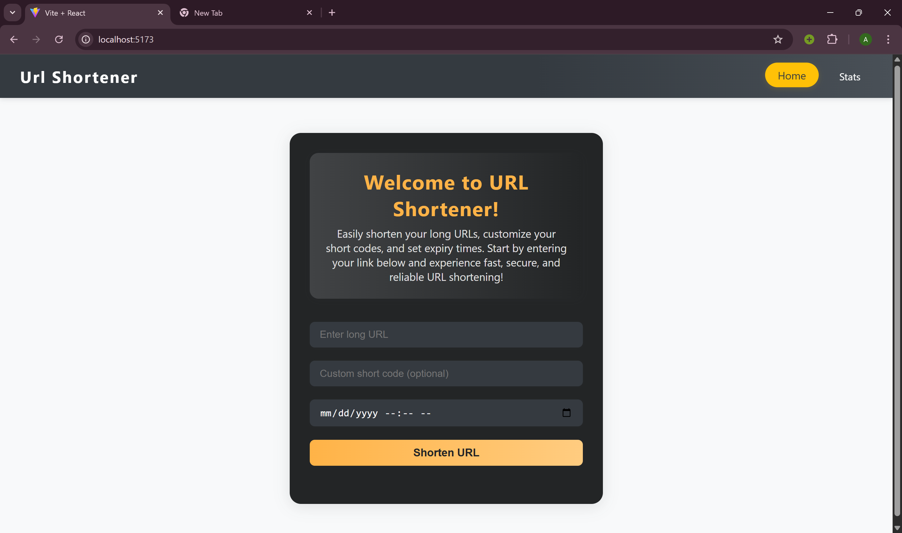
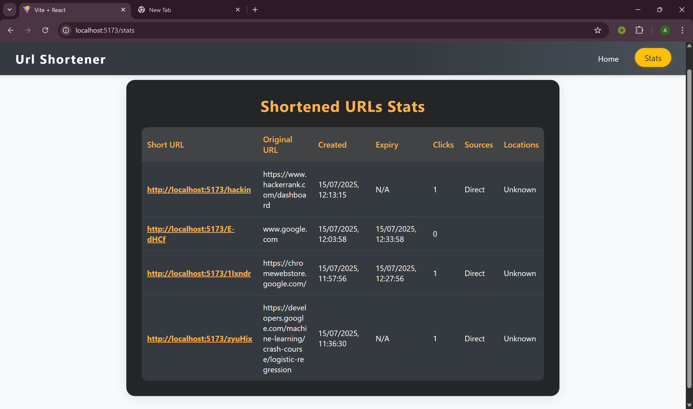

#  URL Shortener Web App

This is a full-stack URL Shortener application built with **MERN Stack**. It allows users to shorten long URLs, optionally set expiry time and custom short codes, and provides a detailed statistics page for tracking clicks including **location**, **referrer**, and **time of access**.

---

##  Project Structure

```

root/
├── backend/        # Express server with MongoDB
├── frontend/       # React client interface (no login required)
└── logger/         # Reusable logging middleware package

````

---


##  Features

- URL shortening with optional custom code
-  Expiry time (defaults to 30 minutes if not provided)
-  Statistics page with:
  - Click count
  - Source (referrer)
  - Geolocation
  - Expiry & creation time
-  Reusable logging middleware to record lifecycle events (errors, info, warnings)

---

##  Tech Stack

| Layer    | Tech                          |
|----------|-------------------------------|
| Frontend | React, React Router, Bootstrap, Axios |
| Backend  | Node.js, Express.js, MongoDB, Mongoose |
| Logging  | Custom logger using Axios POST |
| Geo      | geoip-lite                    |

---

## Screenshots

> Replace these placeholders with your actual images (store in a `/screenshots/` folder or use direct image links)

###  Home Page


###  Stats Page


---

## Folder Overview

### 1. `/backend`

- **APIs**
  - `POST /shorten`: Create a short URL
  - `GET /:code`: Redirect to the original URL
  - `GET /stats`: View analytics

- **Logger Integration**: Logs events like invalid input, redirects, expiration, etc.

- **MongoDB Model**: URL schema with embedded click logs

### 2. `/frontend`

- Simple React interface to:
  - Enter long URL, expiry, and custom code
  - Show shortened URL
  - View stats of all created URLs

### 3. `/logger`

- Reusable function:
  ```js
  Log(stack, level, package, message);
```

* Example:

  ```js
  Log("backend", "error", "controller", "Invalid long URL provided");
  ```

---

##  Testing Instructions

1. **Start MongoDB**

```bash
mongod
```

2. **Run backend**

```bash
cd backend
npm install
npm run dev
```

3. **Run frontend**

```bash
cd frontend
npm install
npm start
```

4. **Logger**

* It is auto-used inside the backend.
* To test directly:

  ```js
  Log("test", "info", "manual", "Test log message");
  ```

---

##  Environment Variables

### `/backend/.env`

```env
PORT=5000
MONGO_URI=mongodb://localhost:27017/urlshortener
BASE_URL=http://localhost:5000
```

---

##  API Documentation

### `POST /shorten`

```json
{
  "originalUrl": "https://example.com",
  "customCode": "mycode123",          // optional
  "expiresAt": "2025-07-15T12:00:00"  // optional
}
```

#### Response

```json
{
  "shortUrl": "http://localhost:5000/mycode123"
}
```

---

### `GET /:code`

Redirects to the original URL if not expired.

---

### `GET /stats`

Returns all created short URLs with:

* Creation time
* Expiry
* Clicks
* Referrer sources
* Locations

---

## License

This project is open-source and available under the [MIT License](LICENSE).

